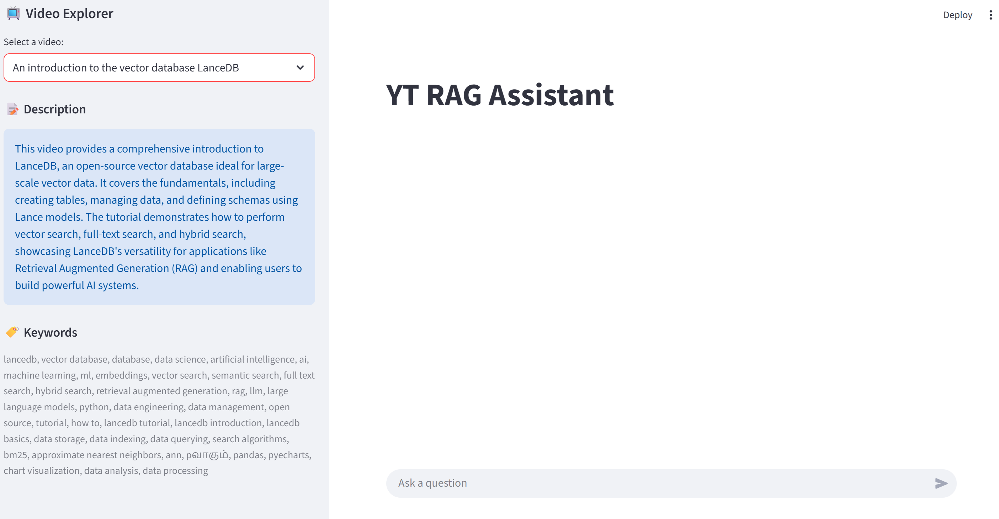
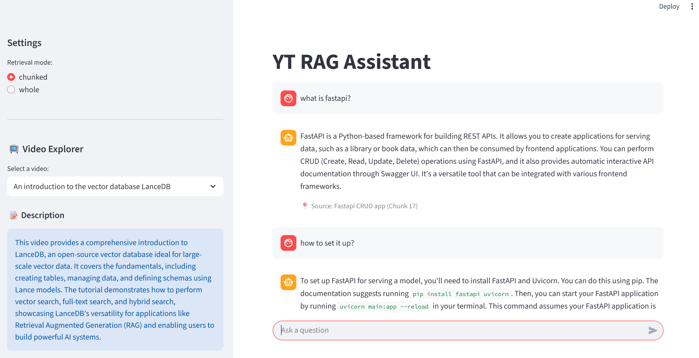

# yt-rag-assistant — RAG from YouTube transcripts (Gemini + LanceDB)

A RAG-based assistant that ingests YouTube transcripts to enable conversational Q&A, summarization, and context-aware chat over video content, deployable locally OR in the cloud.

Ingest Markdown transcripts, build a local LanceDB knowledge base, and chat with it via a FastAPI app hosted as an Azure Function + a Streamlit UI.

## Highlights (what this lab demonstrates)

- Deterministic preprocessing: SHA256 dedup + repeatable outputs
- Clean + chunk transcripts for retrieval (token-aware splitting via `RecursiveCharacterTextSplitter`: 400 token chunks, 100 token overlap)
- Unified LanceDB index in `knowledge_base/transcripts_unified` with:
  - `parent_videos` (per-video metadata like summary/keywords)
  - `video_chunks` (vectorized chunks for retrieval)
- Stateless chat for serverless: the frontend sends the full history per request

## Key learning points (design choices)

- **Hash-based dedup is a cheap win**: normalize text then SHA256 to avoid re-embedding duplicates and keep ingestion idempotent.
- **Cleaning improves both retrieval + generation**: remove timestamps/markup/fillers so embeddings represent meaning and prompts waste fewer tokens.
- **Chunking beats “one big embedding”**: without chunking, embeddings become a semantic average and retrieval might get vague.
- **Prefer structure-aware chunking over topic modeling for transcripts**: speech topics drift; topic clustering is often brittle/expensive, while paragraph/sentence-ish splitting + overlap is stable.
- **Pick one reference tokenizer and size conservatively**: tokenizers differ, but are usually correlated (often ~±10–20%); use a hard max to avoid pathological chunks.
- **Store metadata alongside chunks**: keep a parent table (summary/keywords) + child chunk table so the API can serve both “YouTube description/tags” and RAG citations cleanly.
- **Serverless-friendly memory**: keep chat history in the Streamlit session and send it with each request so Azure Functions stays stateless.

### Summary of Design Choices

| Feature | Choice | Reason |
| :--- | :--- | :--- |
| **Database** | LanceDB | Embedded (no server setup), fast, handles vectors + metadata. |
| **LLM** | Gemini | Large context window, cost-effective for RAG. |
| **Chunking** | Token-based (400t) | Balance between granularity and context retention. |
| **API** | FastAPI on Azure Functions | Standard Python async framework, serverless deployment. |
| **Frontend** | Streamlit | Rapid UI development, handles session state client-side. |

## How the pieces connect

```
data/*.md
  └─ scripts/deduplicate_files.py      → data_cleaned/01_deduplicated/unique
      └─ scripts/normalize_transcripts.py → data_cleaned/02_normalized
          └─ ingestion_unified.py      → knowledge_base/transcripts_unified (LanceDB)

Streamlit UI (frontend/app.py)
  └─ calls Azure Functions HTTP API (function_app.py → api.py)
      └─ backend/rag.py retrieves from LanceDB and asks Gemini to answer
```

### Retrieval Flow (Search → Join → Generate)

1.  **Search**: Query the `video_chunks` table to find the top relevant text segments (400-token chunks).
2.  **Join**: Use the `md_id` (foreign key) to look up the `filename` and `title` from `parent_videos`.
3.  **Generate**: Pass the chunks + metadata to Gemini to generate the answer.

Key API endpoints:
- `GET /videos` (what’s in the Knowledge Base)
- `POST /query` (main chat endpoint; history comes from the frontend)

Note: `POST /session` and `GET /sessions` are legacy endpoints from an earlier stateful prototype (server-side `session_id`). The current design is stateless: the frontend sends full `history` with each `POST /query`.

## Screenshots

**Video Explorer**: list transcripts, then show per-video description + keywords after selection.



**RAG Chat (chunked retrieval)**: multi-turn chat history + source citations.



## Run locally

### Prereqs
- Python 3.11
- Azure Functions Core Tools (`func`)
- Gemini key in env: `GOOGLE_API_KEY`

### Setup

```bash
# install deps (either is fine)
uv pip install -r requirements.txt


# env
copy .env.example .env
```

### Build the knowledge base

```bash
# 1) Put transcripts in ./data as .md files

# 2) Deduplicate + normalize
python scripts/deduplicate_files.py
python scripts/normalize_transcripts.py

# 3) Ingest into LanceDB (writes to ./knowledge_base/transcripts_unified)
python ingestion_unified.py
```

### Start API + UI

```bash
# API (Azure Functions local runtime)
func host start

# UI (new terminal)
streamlit run frontend/app.py
```

By default the UI calls `http://127.0.0.1:7071`.

## Deploy to Azure (backend)

This repo deploys the API as an Azure Function (FastAPI via ASGI in `function_app.py`).

### 1) Ensure the knowledge base is included

The API reads from `knowledge_base/transcripts_unified`. On Azure Functions, the app copies it to `/tmp/knowledge_base` on cold start because LanceDB needs writable files.

Practical implication: run ingestion locally first, and deploy the resulting `knowledge_base/` folder with the Function App.

### 2) Publish the Function App

Using Azure Functions Core Tools:

```bash
func azure functionapp publish <YOUR_FUNCTION_APP_NAME>
```

In Azure Portal → Function App → Configuration, set:
- `GOOGLE_API_KEY` (required)
- `GEMINI_MODEL_KEY` (optional; defaults to `flash-lite`)

Note: the Function uses `http_auth_level=FUNCTION`, so requests in Azure require a function key.

### 3) Point the Streamlit UI at Azure

Set these for the Streamlit process (local or hosted elsewhere):
- `API_BASE_URL=https://<YOUR_FUNCTION_APP_NAME>.azurewebsites.net`
- `HOST_KEY=<YOUR_FUNCTION_KEY>` (the UI appends `?code=...` automatically)

Then run:

```bash
streamlit run frontend/app.py
```

## Repo map

- `scripts/` preprocessing (dedup + normalize)
- `ingestion_unified.py` builds the LanceDB index in `knowledge_base/`
- `api.py` FastAPI app (endpoints)
- `function_app.py` Azure Functions entrypoint/proxy
- `frontend/` Streamlit app + API client

## References

- https://docs.langchain.com/oss/python/langchain/overview
- https://www.youtube.com/watch?v=Pk2BeaGbcTE
- https://github.com/ALucek/chunking-strategies/blob/main/chunking.ipynb
- https://lancedb.com/blog/rag-isnt-one-size-fits-all/
- https://docs.databricks.com/aws/en/generative-ai/tutorials/ai-cookbook/quality-data-pipeline-rag
- https://www.youtube.com/watch?v=Lk6D1huUK0s

## Note on “serverless-friendly memory” (assignment requirement)

One task was to add conversational memory (ok if it only lasts for a single session) and to provide a history endpoint.

Why this design: when deployed to Azure Functions, relying on in-memory server sessions is unreliable because each request can land on a different instance (so the “session store” is not shared), which can lead to “session not found” style failures.

What this project does instead:
- **Memory for a single session**: stored in the Streamlit session (`st.session_state`) and mirrored in the frontend client history.
- **History endpoint**: `POST /history` accepts `{ "history": [...] }` and returns it back (the backend does not persist history).

This keeps the backend stateless (serverless-safe) while still giving the user a chatbot-style multi-turn experience.

## AI assistance disclosure

LLMs were used as a support tool: to brainstorm solutions, learn common practices, generate small helper snippets, help refactor when changes required updates across multiple files, and improve the phrasing of documentation/comments. All architectural decisions, integration, and final code review/testing were done by me, and I can explain the implementation. LLMs were not used to generate the entire solution end-to-end.

